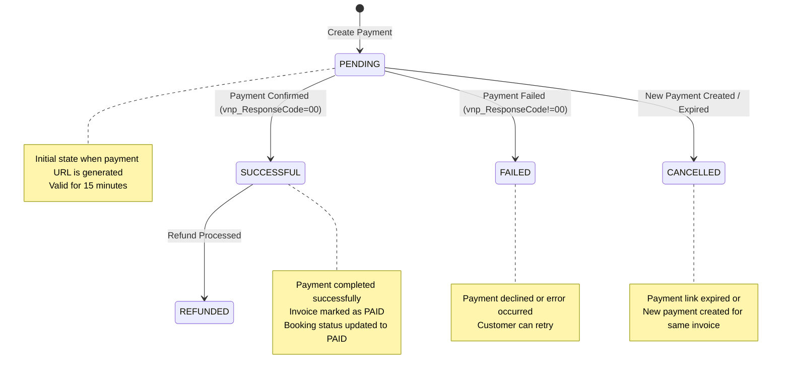

# Payment Flow Documentation

## Overview
This document describes the complete payment flow in the car wash booking system, including all states, transitions, validations, and edge cases.

---

## Payment States



### State Descriptions

| State | Description | Can Transition To | Triggered By |
|-------|-------------|-------------------|--------------|
| **PENDING** | Payment initiated, waiting for customer to complete | SUCCESSFUL, FAILED, CANCELLED | Customer creates payment URL |
| **SUCCESSFUL** | Payment completed successfully | REFUNDED | VNPay IPN with responseCode=00 |
| **FAILED** | Payment failed or declined | - | VNPay IPN with responseCode!=00 |
| **CANCELLED** | Payment cancelled or expired | - | 15-minute timeout or new payment created |
| **REFUNDED** | Payment refunded to customer | - | Admin initiates refund |

---

## Complete Payment Flow

```mermaid
sequenceDiagram
    actor Customer
    participant Frontend
    participant Backend
    participant Database
    participant VNPay
    
    rect rgb(230, 240, 255)
        Note over Customer,VNPay: Phase 1: Payment Initiation
        Customer->>Frontend: Click "Pay Now"
        Frontend->>Backend: POST /api/payments/create-payment<br/>{invoiceId: 1}
        
        Backend->>Database: Find Invoice by ID
        Database-->>Backend: Invoice Details
        
        Backend->>Backend: Validate Invoice Status<br/>(Must not be PAID)
        
        Backend->>Database: Check for existing PENDING payment
        Database-->>Backend: Existing Payment (if any)
        
        alt Payment exists and not expired (< 15 min)
            Backend->>Backend: Reuse existing orderCode
            Backend->>Backend: Generate VNPay URL
            Backend-->>Frontend: Return existing payment URL
        else Payment expired or doesn't exist
            Backend->>Database: Mark old payment as CANCELLED
            Backend->>Backend: Generate new orderCode<br/>(VNP + timestamp)
            Backend->>Database: Create Payment record (PENDING)
            Backend->>Backend: Build VNPay parameters
            Backend->>Backend: Generate HMAC-SHA512 signature
            Backend->>Backend: Construct payment URL
            Backend-->>Frontend: Return payment URL + orderCode
        end
        
        Frontend-->>Customer: Display payment URL
    end
    
    rect rgb(255, 240, 230)
        Note over Customer,VNPay: Phase 2: Customer Payment
        Customer->>VNPay: Redirect to VNPay URL
        VNPay->>Customer: Display payment form
        Customer->>VNPay: Enter payment details<br/>(Card/Bank info)
        VNPay->>VNPay: Process payment
    end
    
    rect rgb(240, 255, 230)
        Note over Customer,VNPay: Phase 3: IPN Callback (Server-to-Server)
        VNPay->>Backend: POST /vnpay-ipn<br/>(IPN Callback with params)
        
        Backend->>Backend: Extract vnp_SecureHash
        Backend->>Backend: Calculate expected hash
        Backend->>Backend: Verify signature
        
        alt Signature Invalid
            Backend-->>VNPay: {RspCode: "97", Message: "Invalid Signature"}
        else Signature Valid
            Backend->>Database: Find Payment by orderCode
            
            alt Payment Not Found
                Backend-->>VNPay: {RspCode: "01", Message: "Order not found"}
            else Payment Found
                Backend->>Backend: Validate amount matches
                
                alt Amount Mismatch
                    Backend-->>VNPay: {RspCode: "04", Message: "Invalid Amount"}
                else Amount Valid
                    Backend->>Backend: Check payment status
                    
                    alt Already Processed
                        Backend-->>VNPay: {RspCode: "02", Message: "Order already confirmed"}
                    else Status is PENDING
                        Backend->>Database: Check if invoice already paid
                        
                        alt Invoice Already Paid (Duplicate)
                            Backend->>Database: Update payment to FAILED
                            Backend-->>VNPay: {RspCode: "02", Message: "Invoice already paid"}
                        else Invoice Not Paid
                            alt vnp_ResponseCode = "00" (Success)
                                Backend->>Database: Update Payment to SUCCESSFUL
                                Backend->>Database: Update Invoice to PAID
                                Backend->>Database: Update Booking to PAID
                                Backend->>Database: Cancel other PENDING payments
                                Backend-->>VNPay: {RspCode: "00", Message: "Payment Success"}
                            else vnp_ResponseCode != "00" (Failed)
                                Backend->>Database: Update Payment to FAILED
                                Backend-->>VNPay: {RspCode: vnp_ResponseCode, Message: "Payment Failed"}
                            end
                        end
                    end
                end
            end
        end
    end
    
    rect rgb(255, 255, 230)
        Note over Customer,VNPay: Phase 4: Customer Return
        VNPay->>Customer: Redirect to returnUrl
        Customer->>Frontend: Return to application
        Frontend->>Backend: GET /api/payments/status?orderCode=XXX
        Backend->>Database: Find Payment by orderCode
        Database-->>Backend: Payment details
        Backend-->>Frontend: {status, responseCode, message}
        Frontend-->>Customer: Display payment result
    end
```



---

## Detailed Flow Steps

### 1. Payment Creation (`POST /api/payments/create-payment`)

#### Input Validation
```json
{
  "invoiceId": 1  // Required, must exist
}
```

#### Process Flow
1. **Find Invoice**
   - Query database for invoice by ID
   - Throw `EntityNotFoundException` if not found

2. **Validate Invoice Status**
   - Check if `invoice.status == PAID`
   - Throw `InvalidOperation` if already paid

3. **Check Existing Pending Payment**
   - Query for most recent payment for this invoice
   - If exists and status is `PENDING`:
     - Calculate expiry time: `createdAt + 15 minutes`
     - If not expired: **Reuse** existing payment
     - If expired: **Cancel** and create new payment

4. **Create New Payment**
   - Generate unique `orderCode`: `VNP{timestamp}`
   - Create Payment entity:
     ```java
     Payment.builder()
       .invoice(invoice)
       .paymentMethod(VNPAY)
       .amount(invoice.totalAmount)
       .status(PENDING)
       .orderCode(orderCode)
       .build()
     ```
   - Save to database

5. **Generate VNPay URL**
   - Build parameters map (sorted alphabetically)
   - Calculate HMAC-SHA512 signature
   - Construct final URL

#### Response
```json
{
  "paymentUrl": "https://sandbox.vnpayment.vn/paymentv2/vpcpay.html?vnp_Amount=...",
  "orderCode": "VNP1732302909123"
}
```

---

### 2. VNPay URL Generation

#### Required Parameters
| Parameter | Value | Description |
|-----------|-------|-------------|
| `vnp_Version` | 2.1.0 | VNPay API version |
| `vnp_Command` | pay | Payment command |
| `vnp_TmnCode` | {config} | Merchant code |
| `vnp_Amount` | {amount * 100} | Amount in VND cents |
| `vnp_CurrCode` | VND | Currency code |
| `vnp_TxnRef` | {orderCode} | Transaction reference |
| `vnp_OrderInfo` | Thanh toan don hang {orderCode} | Order description |
| `vnp_OrderType` | other | Order type |
| `vnp_Locale` | vn | Language |
| `vnp_ReturnUrl` | {config} | Return URL after payment |
| `vnp_IpAddr` | {clientIP} | Client IP address |
| `vnp_CreateDate` | yyyyMMddHHmmss | Creation timestamp |
| `vnp_SecureHash` | {calculated} | HMAC-SHA512 signature |

#### Signature Generation
```java
// 1. Sort parameters alphabetically
Map<String, String> sortedParams = new TreeMap<>(params);

// 2. Build hash data string
StringBuilder hashData = new StringBuilder();
for (Entry<String, String> entry : sortedParams.entrySet()) {
    hashData.append(entry.getKey())
            .append('=')
            .append(URLEncoder.encode(entry.getValue(), UTF-8))
            .append('&');
}
// Remove trailing '&'
String hashString = hashData.substring(0, hashData.length() - 1);

// 3. Calculate HMAC-SHA512
Mac hmac = Mac.getInstance("HmacSHA512");
SecretKeySpec secret = new SecretKeySpec(hashSecret.getBytes(), "HmacSHA512");
hmac.init(secret);
byte[] hashBytes = hmac.doFinal(hashString.getBytes());

// 4. Convert to hex string
String signature = bytesToHex(hashBytes);
```

---

### 3. IPN Callback Handling (`POST /vnpay-ipn`)

#### IPN Parameters from VNPay
```
vnp_Amount=10000000
vnp_BankCode=NCB
vnp_BankTranNo=VNP14234567
vnp_CardType=ATM
vnp_OrderInfo=Thanh toan don hang VNP1732302909123
vnp_PayDate=20231123015500
vnp_ResponseCode=00
vnp_TmnCode=4BX9X4TI
vnp_TransactionNo=14234567
vnp_TransactionStatus=00
vnp_TxnRef=VNP1732302909123
vnp_SecureHash=abc123...
```

#### Validation Steps

##### Step 1: Signature Verification
```java
// Extract received hash
String receivedHash = params.get("vnp_SecureHash");
params.remove("vnp_SecureHash");

// Calculate expected hash
String calculatedHash = createVnpayHash(params, hashSecret);

// Verify
if (!calculatedHash.equals(receivedHash)) {
    return new VnpayIpn("97", "Invalid Signature");
}
```

##### Step 2: Find Payment
```java
String orderCode = params.get("vnp_TxnRef");
Payment payment = paymentRepo.findByOrderCode(orderCode)
    .orElse(null);

if (payment == null) {
    return new VnpayIpn("01", "Order not found");
}
```

##### Step 3: Amount Validation
```java
BigDecimal vnpayAmount = new BigDecimal(params.get("vnp_Amount"))
    .divide(new BigDecimal("100"));

if (payment.getAmount().compareTo(vnpayAmount) != 0) {
    return new VnpayIpn("04", "Invalid Amount");
}
```

##### Step 4: Status Check
```java
if (payment.getStatus() != PENDING) {
    return new VnpayIpn("02", "Order already confirmed");
}
```

##### Step 5: Duplicate Payment Check
```java
if (payment.getInvoice().getStatus() == PAID) {
    payment.setStatus(FAILED);
    payment.setResponseCode("02");
    payment.setRawResponseData("Invoice already paid by another transaction");
    paymentRepo.save(payment);
    return new VnpayIpn("02", "Invoice already paid");
}
```

##### Step 6: Process Payment Result
```java
String responseCode = params.get("vnp_ResponseCode");

if ("00".equals(responseCode)) {
    // SUCCESS PATH
    payment.setStatus(SUCCESSFUL);
    payment.setPaidAt(LocalDateTime.now());
    payment.setTransactionRef(params.get("vnp_TransactionNo"));
    payment.setResponseCode(responseCode);
    
    // Update invoice
    invoice.setStatus(PAID);
    invoice.setPaidAt(LocalDateTime.now());
    
    // Update booking
    booking.setBookingStatus(PAID);
    
    // Cancel other pending payments
    List<Payment> otherPending = paymentRepo
        .findByInvoiceIdAndStatus(invoice.getId(), PENDING);
    for (Payment p : otherPending) {
        p.setStatus(CANCELLED);
        p.setResponseCode("02");
        p.setRawResponseData("Cancelled - Invoice already paid");
    }
    
    return new VnpayIpn("00", "Payment Success");
} else {
    // FAILURE PATH
    payment.setStatus(FAILED);
    payment.setResponseCode(responseCode);
    payment.setTransactionRef(params.get("vnp_TransactionNo"));
    
    return new VnpayIpn(responseCode, "Payment Failed");
}
```

---

### 4. Payment Status Check (`GET /api/payments/status`)

#### Request
```
GET /api/payments/status?orderCode=VNP1732302909123
```

#### Response
```json
{
  "status": "SUCCESSFUL",
  "responseCode": "00",
  "message": "Giao dịch thành công (Mã: 00)"
}
```

---

### 5. Payment History (`GET /api/payments/history/{bookingId}`)

#### Request
```
GET /api/payments/history/1
```

#### Response
```json
[
  {
    "id": 1,
    "invoiceNumber": "INV001",
    "orderCode": "VNP1732302909123",
    "amount": 100000.00,
    "status": "SUCCESSFUL",
    "paymentMethod": "VNPAY",
    "createdAt": "2023-11-23T01:49:17",
    "paidAt": "2023-11-23T01:50:00",
    "transactionRef": "14234567",
    "responseCode": "00"
  },
  {
    "id": 2,
    "invoiceNumber": "INV001",
    "orderCode": "VNP1732302800000",
    "amount": 100000.00,
    "status": "CANCELLED",
    "paymentMethod": "VNPAY",
    "createdAt": "2023-11-23T01:30:00",
    "paidAt": null,
    "transactionRef": null,
    "responseCode": "02"
  }
]
```

---

## VNPay Response Codes

### Success Codes
| Code | Meaning | Action |
|------|---------|--------|
| 00 | Transaction successful | Mark payment as SUCCESSFUL |

### Error Codes
| Code | Meaning | User Message |
|------|---------|--------------|
| 07 | Suspicious transaction | Giao dịch bị nghi ngờ gian lận |
| 09 | Card not registered for internet banking | Thẻ chưa đăng ký dịch vụ Internet Banking |
| 10 | Authentication failed (3+ times) | Xác thực thông tin không đúng quá 3 lần |
| 11 | Payment timeout | Đã hết hạn chờ thanh toán |
| 12 | Card locked | Thẻ/Tài khoản bị khóa |
| 13 | Incorrect OTP | Nhập sai mật khẩu OTP |
| 24 | Transaction cancelled by user | Khách hàng hủy giao dịch |
| 51 | Insufficient balance | Tài khoản không đủ số dư |
| 65 | Daily limit exceeded | Vượt quá hạn mức giao dịch trong ngày |
| 75 | Bank under maintenance | Ngân hàng đang bảo trì |
| 79 | Too many incorrect password attempts | Nhập sai mật khẩu quá số lần quy định |

---

## Edge Cases & Business Rules

### 1. Payment Link Expiry
- **Rule**: Payment links expire after 15 minutes
- **Behavior**: 
  - If customer tries to reuse expired link, it will still work (VNPay side)
  - If customer creates new payment within 15 min, old link is reused
  - If customer creates new payment after 15 min, old payment is cancelled

### 2. Duplicate Payment Prevention
- **Scenario**: Customer pays twice for same invoice
- **Prevention**:
  - Check invoice status before processing IPN
  - If invoice already PAID, reject second payment
  - VNPay will auto-refund (responseCode "02")

### 3. Concurrent Payment Attempts
- **Scenario**: Customer opens multiple payment tabs
- **Behavior**:
  - All tabs get same orderCode (within 15 min)
  - Only first successful payment is processed
  - Others are rejected as duplicates

### 4. Payment After Booking Cancellation
- **Scenario**: Booking cancelled but customer completes payment
- **Current Behavior**: Payment succeeds, booking marked as PAID
- **Recommended**: Add booking status check in IPN handler

### 5. Network Failure During IPN
- **Scenario**: IPN callback fails due to network issue
- **VNPay Behavior**: Retries IPN up to 3 times
- **Our Handling**: Idempotent processing (same IPN processed multiple times = same result)

---

## Testing Flows

### Test Success Flow
```
GET /api/payments/simulate-ipn-success?orderCode=VNP1732302909123
```

**Simulates**:
- VNPay sending successful IPN
- Response code: "00"
- Updates payment, invoice, and booking status

### Test Failure Flow
```
GET /api/payments/simulate-ipn-fail?orderCode=VNP1732302909123
```

**Simulates**:
- VNPay sending failed IPN
- Response code: "24" (user cancelled)
- Updates payment to FAILED

---

## Database Impact

### Payment Creation
```sql
INSERT INTO payments (
    invoice_id, payment_method, amount, status, 
    order_code, created_at, updated_at
) VALUES (
    1, 'VNPAY', 100000.00, 'PENDING',
    'VNP1732302909123', NOW(), NOW()
);
```

### Successful Payment
```sql
-- Update payment
UPDATE payments 
SET status = 'SUCCESSFUL',
    paid_at = NOW(),
    transaction_ref = '14234567',
    response_code = '00',
    raw_response_data = '{...}',
    updated_at = NOW()
WHERE order_code = 'VNP1732302909123';

-- Update invoice
UPDATE invoices
SET status = 'PAID',
    paid_at = NOW(),
    updated_at = NOW()
WHERE id = 1;

-- Update booking
UPDATE bookings
SET booking_status = 'PAID',
    updated_at = NOW()
WHERE id = 1;

-- Cancel other pending payments
UPDATE payments
SET status = 'CANCELLED',
    response_code = '02',
    raw_response_data = 'Cancelled - Invoice already paid',
    updated_at = NOW()
WHERE invoice_id = 1 
  AND status = 'PENDING'
  AND order_code != 'VNP1732302909123';
```

---

## Security Considerations

### 1. Signature Verification
- **Always** verify `vnp_SecureHash` before processing IPN
- Use HMAC-SHA512 with secret key
- Reject any IPN with invalid signature

### 2. Amount Validation
- **Always** validate amount matches database record
- Prevent amount tampering attacks

### 3. Idempotency
- **Always** check payment status before updating
- Prevent duplicate processing of same IPN

### 4. HTTPS Required
- **Production**: Use HTTPS for all endpoints
- **IPN URL**: Must be publicly accessible via HTTPS

### 5. Secret Key Protection
- Store in environment variables
- Never commit to version control
- Rotate periodically

---

## Error Handling

### Client Errors (4xx)
```json
{
  "timestamp": "2023-11-23T01:49:17",
  "status": 404,
  "error": "Not Found",
  "message": "Không tìm thấy hóa đơn với ID: 999",
  "path": "/api/payments/create-payment"
}
```

### Business Logic Errors
```json
{
  "timestamp": "2023-11-23T01:49:17",
  "status": 400,
  "error": "Invalid Operation",
  "message": "Hóa đơn đã được thanh toán trước đó.",
  "path": "/api/payments/create-payment"
}
```

### VNPay IPN Errors
```json
{
  "RspCode": "97",
  "Message": "Invalid Signature"
}
```

---

## Monitoring & Logging

### Key Log Points
1. **Payment Creation**: Log invoice ID and order code
2. **URL Generation**: Log order code and amount
3. **IPN Received**: Log all parameters (sanitized)
4. **Signature Verification**: Log success/failure
5. **Payment Status Update**: Log old status → new status
6. **Invoice Update**: Log invoice ID and new status
7. **Errors**: Log full exception stack trace

### Example Logs
```
INFO  - Bắt đầu tạo yêu cầu thanh toán VNPAY cho hóa đơn 1
INFO  - VNPAY ORDER CODE: VNP1732302909123
INFO  - VNPAY AMOUNT: 100000.00
INFO  - Bắt đầu xử lý IPN từ VNPAY
INFO  - IPN: Thanh toán thành công (Success) cho đơn hàng VNP1732302909123
INFO  - Cancelling 2 other PENDING payment(s) for invoice 1 after successful payment
WARN  - IPN: Chữ ký không hợp lệ (Invalid Signature)
ERROR - IPN: Lỗi không xác định
```

---

## Integration Checklist

- [ ] Configure VNPay credentials in `application.properties`
- [ ] Set up public HTTPS endpoint for IPN callback
- [ ] Test payment creation flow
- [ ] Test successful payment flow (simulation)
- [ ] Test failed payment flow (simulation)
- [ ] Test payment link expiry (15 min)
- [ ] Test duplicate payment prevention
- [ ] Verify signature generation/validation
- [ ] Test payment history retrieval
- [ ] Monitor logs for errors
- [ ] Set up alerts for failed payments
- [ ] Document customer support procedures

---

**Last Updated**: 2025-11-23  
**Version**: 1.0
