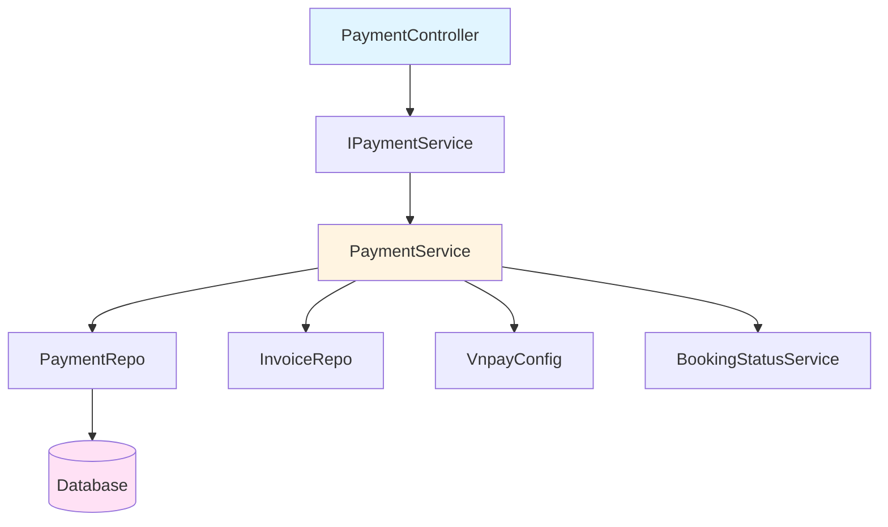
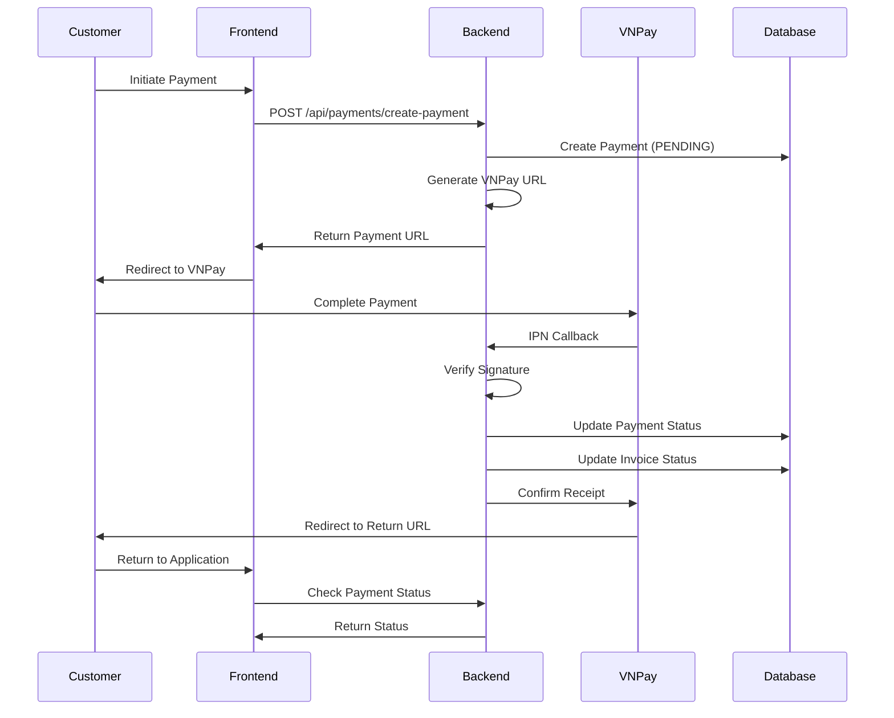

# Payment Module Documentation

## Overview

This module handles payment processing for the car wash booking system, integrating with VNPay payment gateway to enable secure online transactions. The module supports multiple payment methods, tracks payment history, and manages the complete payment lifecycle from initiation to completion.

## Architecture

### Core Components



## Module Structure

### 1. Entity Layer
- **Payment** [`Payment.java`](file:///d:/GitHub/250910_SWP391/demo/src/main/java/com/example/demo/model/entity/Payment.java)
  - Represents payment transactions in the database
  - Key fields:
    - `invoice`: Reference to the invoice being paid
    - `amount`: Payment amount (BigDecimal for precision)
    - `status`: Payment status (PENDING, SUCCESSFUL, FAILED, etc.)
    - `paymentMethod`: Method used for payment
    - `orderCode`: Unique order identifier
    - `transactionRef`: VNPay transaction reference
    - `responseCode`: Payment gateway response code

### 2. Enums

#### PaymentStatus
- `PENDING`: Payment initiated but not completed
- `SUCCESSFUL`: Payment completed successfully
- `FAILED`: Payment failed
- `REFUNDED`: Payment has been refunded
- `CANCELLED`: Payment cancelled (e.g., when creating a new payment request)

#### PaymentMethod
- `VNPAY`: VNPay payment gateway
- `MOMO`: MoMo e-wallet
- `ZALOPAY`: ZaloPay e-wallet
- `CASH`: Cash payment
- `CREDIT_CARD`: Credit card
- `DEBIT_CARD`: Debit card
- `BANK_TRANSFER`: Bank transfer
- `E_WALLET`: Generic e-wallet
- `QR_CODE`: QR code payment
- `PAYPAL`: PayPal

### 3. DTOs

#### Request DTOs [`PaymentRequest.java`](file:///d:/GitHub/250910_SWP391/demo/src/main/java/com/example/demo/model/dto/PaymentRequest.java)
- **CreatePayment**: Used to initiate a payment
  - `invoiceId`: ID of the invoice to be paid

#### Response DTOs [`PaymentResponse.java`](file:///d:/GitHub/250910_SWP391/demo/src/main/java/com/example/demo/model/dto/PaymentResponse.java)
- **PaymentURL**: Contains the payment URL and order code
- **PaymentStatusDetail**: Payment status with response code and message
- **VnpayIpn**: Response for VNPay IPN (Instant Payment Notification)
- **Transaction**: Payment transaction details for history
- **RefundResult**: Result of a refund operation

### 4. Service Layer

#### IPaymentService Interface
Defines the contract for payment operations:
- `createPayment()`: Create a new payment and generate payment URL
- `handleVnpayIpn()`: Handle VNPay IPN callbacks
- `checkPaymentStatus()`: Check the status of a payment
- `getPaymentHistory()`: Retrieve payment history for a booking
- `simulateIpnSuccess()`: Simulate successful payment (testing)
- `simulateIpnFail()`: Simulate failed payment (testing)

#### PaymentService Implementation [`PaymentService.java`](file:///d:/GitHub/250910_SWP391/demo/src/main/java/com/example/demo/service/impl/PaymentService.java)
Core business logic including:
- Payment URL generation with VNPay-compliant parameters
- HMAC-SHA512 signature generation for secure communication
- IPN handling with signature verification
- Status management and invoice updates
- Payment history retrieval

### 5. Controller Layer [`PaymentController.java`](file:///d:/GitHub/250910_SWP391/demo/src/main/java/com/example/demo/controller/PaymentController.java)

REST API endpoints for payment operations.

### 6. Configuration [`VnpayConfig.java`](file:///d:/GitHub/250910_SWP391/demo/src/main/java/com/example/demo/config/VnpayConfig.java)

VNPay integration configuration:
- `tmnCode`: Merchant code
- `hashSecret`: Secret key for signature generation
- `url`: VNPay payment gateway URL
- `returnUrl`: URL where users are redirected after payment
- `ipnUrl`: URL for VNPay to send payment notifications

## API Endpoints

### POST `/api/payments/create-payment`
**Description**: Create a payment URL for an invoice

**Request Body**:
```json
{
  "invoiceId": 1
}
```

**Response**:
```json
{
  "paymentUrl": "https://sandbox.vnpayment.vn/paymentv2/vpcpay.html?...",
  "orderCode": "PAY20231123014917123"
}
```

---

### GET `/api/payments/history/{bookingId}`
**Description**: Get payment transaction history for a booking

**Path Parameters**:
- `bookingId`: Booking ID

**Response**:
```json
[
  {
    "id": 1,
    "invoiceNumber": "INV001",
    "orderCode": "PAY20231123014917123",
    "amount": 100000.00,
    "status": "SUCCESSFUL",
    "paymentMethod": "VNPAY",
    "createdAt": "2023-11-23T01:49:17",
    "paidAt": "2023-11-23T01:50:00",
    "transactionRef": "14234567",
    "responseCode": "00"
  }
]
```

---

### GET `/api/payments/status`
**Description**: Check payment status by order code

**Query Parameters**:
- `orderCode`: Order code

**Response**:
```json
{
  "status": "SUCCESSFUL",
  "responseCode": "00",
  "message": "Thanh toán thành công!"
}
```

---

### GET `/api/payments/simulate-ipn-success`
**Description**: Simulate a successful payment IPN (for testing)

**Query Parameters**:
- `orderCode`: Order code

**Response**:
```json
{
  "RspCode": "00",
  "Message": "Confirm Success"
}
```

---

### GET `/api/payments/simulate-ipn-fail`
**Description**: Simulate a failed payment IPN (for testing)

**Query Parameters**:
- `orderCode`: Order code

**Response**:
```json
{
  "RspCode": "24",
  "Message": "Giao dịch bị hủy hoặc không thể thanh toán"
}
```

## Payment Flow



## Key Features

### 1. **Secure Payment Processing**
- HMAC-SHA512 signature verification for all VNPay communications
- Duplicate payment prevention
- Secure hash generation for payment URLs

### 2. **Payment Status Management**
The module tracks payments through various states:
- **PENDING**: Initial state when payment is created
- **SUCCESSFUL**: Payment completed successfully
- **FAILED**: Payment failed or was declined
- **CANCELLED**: Payment cancelled (automatically when a new payment is created for the same invoice)

### 3. **Invoice Integration**
- Automatic cancellation of previous pending payments when creating new ones
- Invoice status update upon successful payment
- Invoice amount validation

### 4. **Payment History**
- Complete transaction history per booking
- Detailed transaction information including timestamps and response codes

### 5. **Testing Support**
- Simulation endpoints for success/fail scenarios
- Detailed logging for debugging

## VNPay Integration

### Configuration Requirements

Set the following properties in `application.properties` or `application.yml`:

```properties
vnpay.tmnCode=YOUR_TMN_CODE
vnpay.hashSecret=YOUR_HASH_SECRET
vnpay.url=https://sandbox.vnpayment.vn/paymentv2/vpcpay.html
vnpay.returnUrl=http://your-domain.com/payment-return
vnpay.ipnUrl=http://your-domain.com/api/payments/vnpay-ipn
```

### VNPay Response Codes

| Code | Meaning |
|------|---------|
| 00 | Transaction successful |
| 07 | Transaction successful, suspect fraud |
| 09 | Card not registered for Internet Banking |
| 10 | Authentication failed |
| 11 | Payment timeout |
| 12 | Card locked |
| 13 | Incorrect OTP |
| 24 | Transaction cancelled |
| 51 | Insufficient balance |
| 65 | Exceeded daily transaction limit |
| 75 | Payment gateway under maintenance |
| 79 | Transaction failed |

## Error Handling

The module implements comprehensive error handling:

1. **Invoice Not Found**: Throws exception when invoice doesn't exist
2. **Invoice Already Paid**: Prevents duplicate payments
3. **Invalid Signature**: Rejects IPN callbacks with invalid signatures
4. **Payment Not Found**: Returns appropriate error when payment doesn't exist
5. **Duplicate Transaction**: Prevents processing the same transaction multiple times

## Database Schema

```sql
CREATE TABLE payments (
    id BIGINT PRIMARY KEY AUTO_INCREMENT,
    invoice_id BIGINT NOT NULL,
    payment_method VARCHAR(50) NOT NULL,
    amount DECIMAL(19,2) NOT NULL,
    status VARCHAR(50) NOT NULL,
    order_code VARCHAR(100) UNIQUE NOT NULL,
    transaction_ref VARCHAR(255),
    response_code VARCHAR(10),
    paid_at DATETIME,
    raw_response_data NVARCHAR(MAX),
    created_at DATETIME NOT NULL,
    updated_at DATETIME NOT NULL,
    FOREIGN KEY (invoice_id) REFERENCES invoices(id)
);
```

## Best Practices

1. **Use BigDecimal for Amounts**: Always use `BigDecimal` for monetary values to avoid floating-point precision issues

2. **Idempotency**: The module ensures that processing the same IPN callback multiple times doesn't cause duplicate updates

3. **Security**: 
   - Always verify VNPay signatures before processing IPN callbacks
   - Use HTTPS for production environments
   - Keep the hash secret secure

4. **Logging**: 
   - All payment transactions are logged
   - Raw response data is stored for debugging purposes

5. **Testing**: 
   - Use simulation endpoints for local testing
   - Test various payment scenarios (success, failure, timeout)

## Dependencies

- **Spring Boot**: Web framework
- **Spring Data JPA**: Database access
- **Lombok**: Reduce boilerplate code
- **Jakarta Validation**: Input validation
- **Swagger/OpenAPI**: API documentation

## Future Enhancements

- [ ] Add support for payment refunds
- [ ] Implement payment retry mechanism
- [ ] Add webhook support for real-time payment notifications
- [ ] Support for additional payment gateways
- [ ] Payment analytics and reporting
- [ ] Automated payment reconciliation

## Troubleshooting

### Payment URL Generation Issues
- Verify VNPay configuration values
- Check that all required parameters are included
- Ensure proper URL encoding

### IPN Not Received
- Check that `vnpay.ipnUrl` is publicly accessible
- Verify firewall settings
- Check VNPay dashboard for IPN logs

### Signature Verification Failed
- Ensure `hashSecret` matches VNPay configuration
- Verify parameter ordering (alphabetical by key)
- Check for proper encoding of special characters

## Contact & Support

For issues or questions related to the payment module, please contact the development team or refer to the VNPay documentation at: https://sandbox.vnpayment.vn/apis/docs/

---

**Last Updated**: 2025-11-23  
**Module Version**: 1.0  
**VNPay API Version**: 2.1.0
