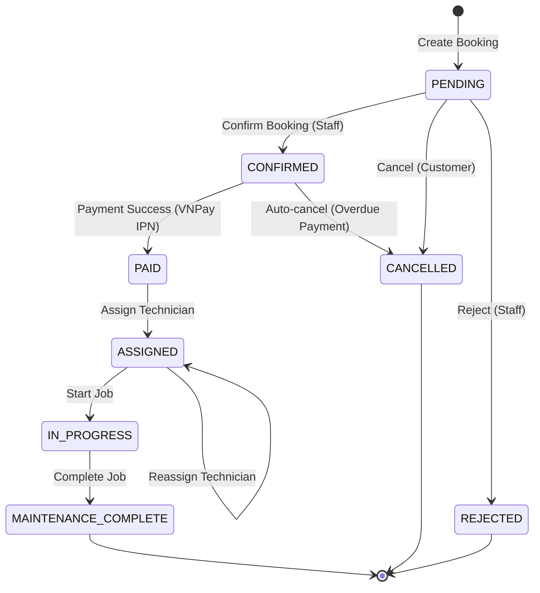
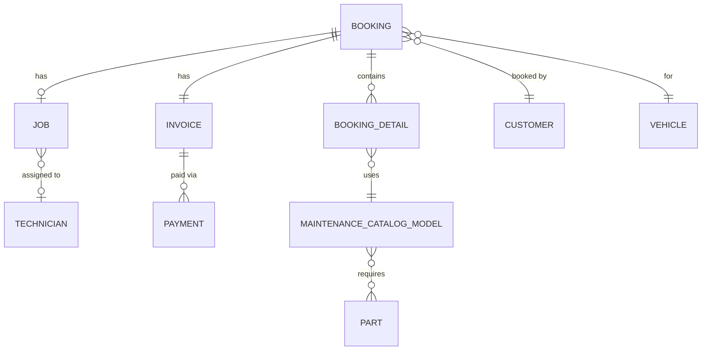

# Booking Flow Explanation - Complete State Machine

This document explains the complete booking lifecycle in your vehicle maintenance system, including what happens at each state, what validations are performed, and what actions are taken.

---

## 📊 Booking Status Overview

The system uses a unified `BookingStatus` enum with the following states:

```java
public enum BookingStatus {
    // ===== SCHEDULE PHASE =====
    PENDING,              // Đã đặt lịch, chờ xác nhận
    CONFIRMED,            // Xác nhận (Giả định là khách hàng sẽ luôn đem xe đến)
    PAID,                 // Đã thanh toán trước (bắt buộc)

    // ===== MAINTENANCE PHASE =====
    ASSIGNED,             // Đã được phân công kỹ thuật viên
    IN_PROGRESS,          // Đang sửa/bảo dưỡng
    MAINTENANCE_COMPLETE, // Đã hoàn thiện bảo dưỡng/sửa chữa

    // ===== CANCELLED STATES =====
    CANCELLED,            // Đã hủy trước khi bắt đầu
    REJECTED,             // Bị từ chối (nếu có lý do hợp lệ)
}
```

---

## 🔄 Complete State Flow Diagram



---

## 📝 Detailed State Explanations

### 1️⃣ PENDING (Đã đặt lịch, chờ xác nhận)

**Entry Point:** When a customer creates a new booking

**What Happens:**
- **File:** [BookingService.java](file:///d:/GitHub/250910_SWP391/demo/src/main/java/com/example/demo/service/impl/BookingService.java#L45-L88)
- Customer selects vehicle, services, and schedule time
- System creates a `Booking` entity with status `PENDING`
- System automatically creates a `DRAFT` invoice
- Booking details (services) are saved

**Validations:**
1. ✅ **Customer exists** and has access to the vehicle
2. ✅ **Vehicle exists** and belongs to the customer
3. ✅ **Schedule date is in the future** (not in the past)
4. ✅ **Schedule date is within 7 days** from now
5. ✅ **Schedule time is within working hours** (07:00 - 17:00)
6. ✅ **Time slot is available** (max 5 bookings per time slot)
7. ✅ **Customer hasn't exceeded daily booking limit** (1 booking per day)
8. ✅ **Services are compatible with the vehicle** (VIN validation)

**Key Code:**
```java
// BookingService.createBooking()
Booking booking = Booking.builder()
    .customer(customer)
    .vehicle(vehicle)
    .scheduleDate(scheduleDate)
    .bookingStatus(BookingStatus.PENDING)
    .build();

// Auto-create invoice
invoiceService.create(booking.getId());
```

**Possible Next States:**
- ➡️ `CONFIRMED` (via staff confirmation)
- ➡️ `CANCELLED` (via customer cancellation)
- ➡️ `REJECTED` (via staff rejection)

---

### 2️⃣ CONFIRMED (Xác nhận)

**Entry Point:** Staff confirms the booking after checking parts availability

**What Happens:**
- **File:** [BookingStatusService.java](file:///d:/GitHub/250910_SWP391/demo/src/main/java/com/example/demo/service/impl/BookingStatusService.java#L112-L150)
- Staff reviews the booking and confirms it
- System checks if all required parts are available
- System **reserves the parts** (increases `reserved` quantity)
- Invoice status changes from `DRAFT` to `UNPAID`
- Invoice `dueDate` is set to 1 hour before the scheduled time

**Validations:**
1. ✅ **Booking must be in PENDING status**
2. ✅ **All required parts must be available** (quantity - reserved >= required)
3. ✅ **All parts must be ACTIVE** (not inactive)
4. ✅ **Invoice must exist and be in DRAFT status**

**Key Code:**
```java
// BookingStatusService.confirmBooking()
if(!checkEnoughPartForBooking(booking.getId())) {
    throw new CommonException.InvalidOperation("Không đủ số lượng linh kiện");
}

// Reserve parts
updateReservedParts(booking);

booking.setBookingStatus(BookingStatus.CONFIRMED);

// Update invoice
invoice.setDueDate(booking.getScheduleDate().minusHours(1));
invoice.setStatus(InvoiceStatus.UNPAID);
```

**Scheduled Task:**
- 🕐 **Auto-cancellation scheduler** runs every 15 minutes
- If payment is not made before `dueDate`, the booking is automatically cancelled
- Reserved parts are released back to inventory

**Possible Next States:**
- ➡️ `PAID` (via successful payment)
- ➡️ `CANCELLED` (via auto-cancellation if payment overdue)

---

### 3️⃣ PAID (Đã thanh toán)

**Entry Point:** Customer completes payment via VNPay

**What Happens:**
- **File:** [PaymentService.java](file:///d:/GitHub/250910_SWP391/demo/src/main/java/com/example/demo/service/impl/PaymentService.java#L140-L236)
- VNPay sends IPN (Instant Payment Notification) callback
- System validates the payment signature and amount
- Payment status changes to `SUCCESSFUL`
- Invoice status changes to `PAID`
- Booking status changes to `PAID`

**Validations:**
1. ✅ **VNPay signature is valid** (HMAC-SHA512 verification)
2. ✅ **Payment amount matches invoice amount**
3. ✅ **Payment is not already processed** (idempotency check)
4. ✅ **VNPay response code is "00"** (success)

**Key Code:**
```java
// PaymentService.handleVnpayIpn()
if ("00".equals(vnpResponseCode)) {
    payment.getInvoice().setStatus(InvoiceStatus.PAID);
    payment.getInvoice().setPaidAt(LocalDateTime.now());
    
    Booking booking = invoice.getBooking();
    booking.setBookingStatus(BookingStatus.PAID);
    
    payment.setStatus(PaymentStatus.SUCCESSFUL);
    payment.setPaidAt(LocalDateTime.now());
}
```

**Possible Next States:**
- ➡️ `ASSIGNED` (via technician assignment)

---

### 4️⃣ ASSIGNED (Đã phân công kỹ thuật viên)

**Entry Point:** Staff assigns a technician to the booking

**What Happens:**
- **File:** [BookingStatusService.java](file:///d:/GitHub/250910_SWP391/demo/src/main/java/com/example/demo/service/impl/BookingStatusService.java#L152-L180)
- Staff selects a technician for the job
- System creates a `Job` entity linked to the booking
- Booking status changes to `ASSIGNED`

**Validations:**
1. ✅ **Booking must be in PAID status** (payment required before assignment)
2. ✅ **Technician exists and has TECHNICIAN role**
3. ✅ **Technician is available at the scheduled time** (no overlapping jobs)
4. ✅ **Booking doesn't already have a job**

**Technician Availability Logic:**
- Checks all incomplete jobs for the technician
- For started jobs: busy until `max(estEndTime, now) + 60 minutes buffer`
- For assigned jobs: busy from `scheduleDate` to `scheduleDate + duration + 60 minutes buffer`
- Prevents double-booking

**Key Code:**
```java
// BookingStatusService.assignTechnician()
if (booking.getBookingStatus() != BookingStatus.PAID) {
    throw new CommonException.InvalidOperation("Chưa thanh toán, không thể phân công");
}

boolean checkAvailable = isTechnicianAvailableAtTime(technicianId, booking.getScheduleDate(), null);

Job job = Job.builder()
    .booking(booking)
    .technician(technician)
    .notes("Auto-created job for booking #" + booking.getId())
    .build();

booking.setBookingStatus(BookingStatus.ASSIGNED);
```

**Special Feature: Reassign Technician**
- Can reassign to a different technician if the job hasn't started yet
- Must be in `ASSIGNED` or `PAID` status
- New technician must be available at the original scheduled time
- Logs the reassignment reason for tracking

**Possible Next States:**
- ➡️ `IN_PROGRESS` (via job start)
- ➡️ `ASSIGNED` (via reassignment to different technician)

---

### 5️⃣ IN_PROGRESS (Đang sửa/bảo dưỡng)

**Entry Point:** Technician starts working on the job

**What Happens:**
- **File:** [JobService.java](file:///d:/GitHub/250910_SWP391/demo/src/main/java/com/example/demo/service/impl/JobService.java#L43-L81)
- Technician checks in and starts the maintenance work
- System **deducts parts from inventory** (quantity -= required)
- System **unreserves the parts** (reserved -= required)
- Job `startTime` is set to current time
- Job `estEndTime` is calculated based on service durations
- Booking status changes to `IN_PROGRESS`

**Validations:**
1. ✅ **Job must be in ASSIGNED status**
2. ✅ **Job must have a technician assigned**
3. ✅ **Job hasn't already started** (startTime is null)
4. ✅ **Current time is within acceptable range** of scheduled time
   - Can start up to 30 minutes early
   - Can start up to 60 minutes late
5. ✅ **All required parts are still available** in inventory

**Key Code:**
```java
// JobService.startJob()
if(booking.getBookingStatus() != BookingStatus.ASSIGNED){
    throw new CommonException.InvalidOperation("Booking phải ở trạng thái ASSIGNED");
}

validateStartJobTime(job, LocalDateTime.now());

// Deduct parts from inventory
usePartsForMaintenance(booking);

// Update status
booking.setBookingStatus(BookingStatus.IN_PROGRESS);

// Set times
long totalEstTimeMinutes = calculateTotalDuration(booking);
job.setStartTime(LocalDateTime.now());
job.setEstEndTime(LocalDateTime.now().plusMinutes(totalEstTimeMinutes));
```

**Part Deduction Logic:**
```java
// For each service in the booking
for (BookingDetail detail : booking.getBookingDetails()) {
    // Get required parts for this service
    List<MaintenanceCatalogModelPart> requiredParts = ...;
    
    for (MaintenanceCatalogModelPart mp : requiredParts) {
        Part part = mp.getPart();
        
        // Deduct from inventory
        part.setQuantity(part.getQuantity().subtract(mp.getQuantityRequired()));
        
        // Unreserve
        part.setReserved(part.getReserved().subtract(mp.getQuantityRequired()));
    }
}
```

**Possible Next States:**
- ➡️ `MAINTENANCE_COMPLETE` (via job completion)

---

### 6️⃣ MAINTENANCE_COMPLETE (Đã hoàn thiện)

**Entry Point:** Technician completes the maintenance work

**What Happens:**
- **File:** [JobService.java](file:///d:/GitHub/250910_SWP391/demo/src/main/java/com/example/demo/service/impl/JobService.java#L83-L102)
- Technician marks the job as complete
- Job `actualEndTime` is set to current time
- Technician can add completion notes
- Booking status changes to `MAINTENANCE_COMPLETE`

**Validations:**
1. ✅ **Job must have started** (startTime is not null)
2. ✅ **Job hasn't already been completed** (actualEndTime is null)
3. ✅ **Technician has access** to complete the job

**Key Code:**
```java
// JobService.completeJob()
if (job.getStartTime() == null)
    throw new CommonException.InvalidOperation("Không thể hoàn thành Job chưa bắt đầu");

if (job.getActualEndTime() != null)
    throw new CommonException.Conflict("Job đã được hoàn thành");

job.setActualEndTime(LocalDateTime.now());
if (notes != null) job.setNotes(notes);

job.getBooking().setBookingStatus(BookingStatus.MAINTENANCE_COMPLETE);
```

**Possible Next States:**
- ✅ **Final state** - booking lifecycle is complete

---

### 7️⃣ CANCELLED (Đã hủy)

**Entry Point:** Customer cancels the booking (only in PENDING status)

**What Happens:**
- **File:** [BookingStatusService.java](file:///d:/GitHub/250910_SWP391/demo/src/main/java/com/example/demo/service/impl/BookingStatusService.java#L51-L79)
- Customer requests cancellation
- Booking status changes to `CANCELLED`

**Validations:**
1. ✅ **Booking must be in PENDING status** (cannot cancel after confirmation)
2. ✅ **Customer has access** to cancel their own booking
3. ✅ **Booking is not already cancelled**

**Auto-Cancellation:**
- If booking is `CONFIRMED` but payment is not made before `dueDate`
- Scheduler runs every 15 minutes
- Invoice status changes to `CANCELLED`
- **Reserved parts are released** back to inventory

**Key Code:**
```java
// BookingStatusService.cancelBooking()
if (!CANCELLABLE_STATUSES.contains(booking.getBookingStatus())) {
    throw new CommonException.InvalidOperation(
        "Chỉ có thể hủy các đặt lịch ở trạng thái PENDING"
    );
}

booking.setBookingStatus(BookingStatus.CANCELLED);
```

**Possible Next States:**
- ✅ **Final state** - booking lifecycle ends

---

### 8️⃣ REJECTED (Bị từ chối)

**Entry Point:** Staff rejects the booking (only in PENDING status)

**What Happens:**
- **File:** [BookingStatusService.java](file:///d:/GitHub/250910_SWP391/demo/src/main/java/com/example/demo/service/impl/BookingStatusService.java#L81-L110)
- Staff reviews and rejects the booking
- Booking status changes to `REJECTED`

**Validations:**
1. ✅ **Booking must be in PENDING status**
2. ✅ **Staff has permission** to reject bookings
3. ✅ **Booking is not already rejected**

**Key Code:**
```java
// BookingStatusService.rejectBooking()
if (!REJECTABLE_STATUSES.contains(booking.getBookingStatus())) {
    throw new CommonException.InvalidOperation(
        "Chỉ có thể từ chối các đặt lịch ở trạng thái PENDING"
    );
}

booking.setBookingStatus(BookingStatus.REJECTED);
```

**Possible Next States:**
- ✅ **Final state** - booking lifecycle ends

---

## 🔐 Access Control Summary

| Action | Who Can Do It | Required Status |
|--------|---------------|-----------------|
| Create Booking | Customer | - |
| Cancel Booking | Customer (owner) | PENDING |
| Confirm Booking | Staff/Admin | PENDING |
| Reject Booking | Staff/Admin | PENDING |
| Assign Technician | Staff/Admin | PAID |
| Reassign Technician | Staff/Admin | ASSIGNED, PAID |
| Start Job | Technician (assigned) | ASSIGNED |
| Complete Job | Technician (assigned) | IN_PROGRESS |
| Make Payment | Customer (owner) | CONFIRMED |

---

## 📦 Inventory Management

### Part Reservation Flow

1. **PENDING → CONFIRMED**: Parts are **reserved**
   - `part.reserved += quantityRequired`
   - Parts are held but not yet deducted from inventory

2. **CONFIRMED → PAID**: No inventory change
   - Parts remain reserved

3. **ASSIGNED → IN_PROGRESS**: Parts are **used**
   - `part.quantity -= quantityRequired`
   - `part.reserved -= quantityRequired`
   - Parts are deducted from available inventory

4. **Auto-Cancel (CONFIRMED → CANCELLED)**: Parts are **unreserved**
   - `part.reserved -= quantityRequired`
   - Parts are released back to available inventory

---

## 🕐 Scheduled Tasks

### Auto-Cancel Overdue Payments
- **Frequency:** Every 15 minutes (`@Scheduled(cron = "0 0/15 * * * *")`)
- **Target:** Bookings in `CONFIRMED` status with `UNPAID` invoices
- **Condition:** `invoice.dueDate < now`
- **Actions:**
  1. Set booking status to `CANCELLED`
  2. Set invoice status to `CANCELLED`
  3. Unreserve all parts
- **File:** [BookingStatusService.java](file:///d:/GitHub/250910_SWP391/demo/src/main/java/com/example/demo/service/impl/BookingStatusService.java#L338-L376)

---

## 🎯 Key Business Rules

1. **Payment is mandatory** before technician assignment
2. **Parts must be available** before confirmation
3. **One booking per customer per day** limit
4. **Maximum 5 bookings per time slot**
5. **Working hours:** 07:00 - 17:00
6. **Booking window:** Must be within 7 days from now
7. **Payment deadline:** 1 hour before scheduled time
8. **Job start window:** 30 minutes early to 60 minutes late
9. **Technician buffer:** 60 minutes between jobs

---

## 🚨 Common Error Scenarios

| Error | Cause | Solution |
|-------|-------|----------|
| "Không đủ số lượng linh kiện" | Parts not available | Wait for restock or modify services |
| "Chưa thanh toán, không thể phân công" | Trying to assign before payment | Complete payment first |
| "Kỹ thuật viên không có sẵn" | Technician has overlapping job | Choose different technician or time |
| "Thời gian đặt lịch không hỗ trợ" | Outside working hours | Choose time between 07:00-17:00 |
| "Thời gian đăt đơn đã bị đầy" | 5 bookings already at that time | Choose different time slot |
| "Khách hàng đã đạt giới hạn đặt lịch" | Already has booking on that day | Cancel existing or choose different day |

---

## 📊 Entity Relationships



---

## 🔍 Related Files

### Core Service Files
- [BookingService.java](file:///d:/GitHub/250910_SWP391/demo/src/main/java/com/example/demo/service/impl/BookingService.java) - Booking CRUD operations
- [BookingStatusService.java](file:///d:/GitHub/250910_SWP391/demo/src/main/java/com/example/demo/service/impl/BookingStatusService.java) - State transitions
- [JobService.java](file:///d:/GitHub/250910_SWP391/demo/src/main/java/com/example/demo/service/impl/JobService.java) - Job management
- [PaymentService.java](file:///d:/GitHub/250910_SWP391/demo/src/main/java/com/example/demo/service/impl/PaymentService.java) - Payment processing

### Entity Files
- [Booking.java](file:///d:/GitHub/250910_SWP391/demo/src/main/java/com/example/demo/model/entity/Booking.java)
- [Job.java](file:///d:/GitHub/250910_SWP391/demo/src/main/java/com/example/demo/model/entity/Job.java)
- [BookingStatus.java](file:///d:/GitHub/250910_SWP391/demo/src/main/java/com/example/demo/model/modelEnum/BookingStatus.java)

### Controller
- [BookingController.java](file:///d:/GitHub/250910_SWP391/demo/src/main/java/com/example/demo/controller/BookingController.java)

---

## 💡 Summary

Your booking system implements a **robust state machine** with:
- ✅ **8 distinct states** covering the entire lifecycle
- ✅ **Strict validation** at each transition
- ✅ **Inventory management** with reservation and deduction
- ✅ **Payment integration** with VNPay
- ✅ **Technician scheduling** with availability checking
- ✅ **Auto-cancellation** for overdue payments
- ✅ **Access control** for different user roles
- ✅ **Business rules enforcement** (limits, working hours, etc.)

The flow ensures that:
1. Parts are available before confirmation
2. Payment is completed before work begins
3. Technicians are available and not double-booked
4. Inventory is accurately tracked
5. Customers can't abuse the system with multiple bookings
